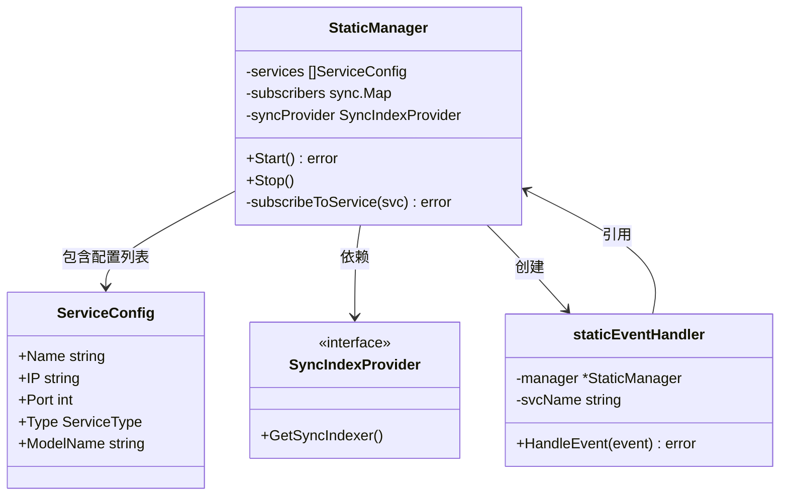

# Static KV Event Manager 设计说明书

## 1. 设计目标

本设计旨在实现一个**静态配置、固定数量**的 KV 事件管理器，专门用于无需 K8s 动态发现的场景。

**核心需求**：
1.  **移除动态扩缩容逻辑**：假设服务列表在启动时固定，不再监听 K8s Pod 事件。
2.  **支持多种服务类型**：统一管理 vLLM 和 Mooncake 服务。
3.  **简化实现**：保留核心的 ZMQ 订阅与事件同步功能，剔除冗余的 K8s 依赖。

## 2. 架构设计

### 2.1 类图结构



### 2.2 核心组件说明

#### `StaticManager`
管理器的入口。
-   **输入**：`[]ServiceConfig`（静态服务列表）。
-   **职责**：
    1.  在 `Start` 时一次性初始化所有服务的 ZMQ 客户端。
    2.  监控 SyncIndexer 的可用性。
    3.  提供 `Stop` 方法优雅关闭所有连接。

#### `ServiceConfig`
统一的配置结构，替代了 K8s Pod 对象。
-   **通用性**：通过 `Type` 字段区分 `vLLM` 和 `Mooncake`，但连接参数（IP、Port）是通用的。

#### `staticEventHandler`
事件处理适配器。
-   **职责**：接收 ZMQClient 的原始事件，注入服务上下文（如 `svcName`、`modelName`），并转发给 Indexer。

## 3. 与原版 Manager 的对比

| 特性 | 原版 Manager (`manager.go`) | 静态 Manager (`static_manager.go`) |
| :--- | :--- | :--- |
| **服务发现** | 动态监听 K8s API (`OnPodAdd`, `OnPodDelete`) | 启动时读取静态列表 (`[]ServiceConfig`) |
| **启动流程** | 轮询等待 Indexer + 持续监听 Pod | 检查 Indexer + 一次性并发连接所有服务 |
| **故障处理** | Pod 删除触发取消订阅 | 仅依赖 ZMQ 内部重连，不移除订阅 |
| **依赖项** | 强依赖 `k8s.io/client-go` | 仅依赖 ZMQ 库，去除了 K8s 依赖 |
| **适用场景** | 弹性伸缩集群 (Kubernetes) | 固定节点集群 / 裸金属部署 |

## 4. 使用指南

### 4.1 初始化配置

在程序启动处（如 `main.go`），构造配置列表：

```go
services := []kvevent.ServiceConfig{
    {
        Name:      "vllm-01",
        IP:        "10.0.0.10",
        Port:      5557,
        Type:      kvevent.ServiceTypeVLLM,
        ModelName: "llama2-7b",
        LoraID:    -1,
    },
    {
        Name:      "mooncake-01",
        IP:        "10.0.0.20",
        Port:      5557,
        Type:      kvevent.ServiceTypeMooncake,
        ModelName: "mooncake-cache",
        LoraID:    -1,
    },
}
```

### 4.2 启动管理器

```go
// 假设 provider 已实现 SyncIndexProvider 接口
manager := kvevent.NewStaticManager(services, provider)

if err := manager.Start(); err != nil {
    log.Fatalf("Failed to start manager: %v", err)
}

// 阻塞运行，或在信号处理中调用 Stop
// ...

manager.Stop()
```

## 5. 扩展性说明

-   **添加新服务类型**：只需在 `ServiceType` 常量中添加定义，并在 `ServiceConfig` 中配置即可。管理器核心逻辑对服务类型是透明的。
-   **自定义处理逻辑**：如果 vLLM 和 Mooncake 的事件格式不同，可以在 `staticEventHandler.HandleEvent` 中根据 `h.manager.services` 查到的类型进行不同的解码或转发处理。

