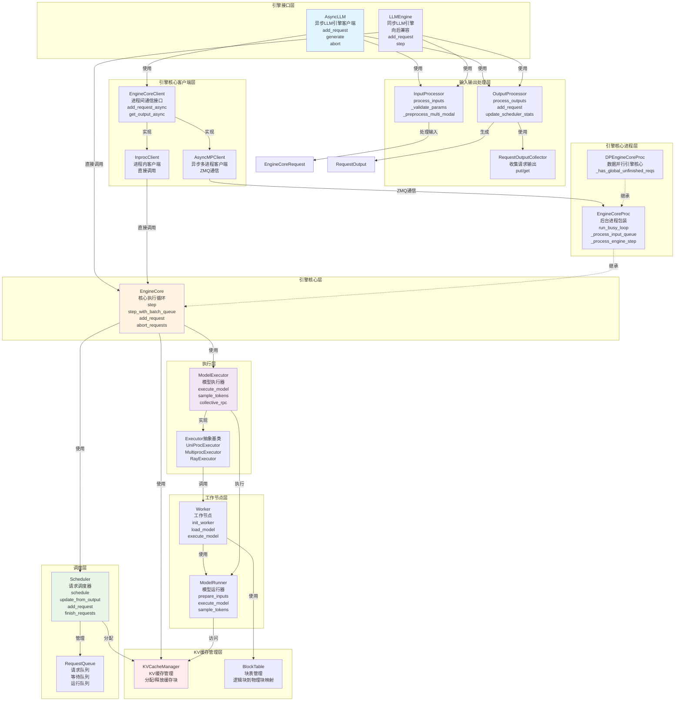

# vLLM 引擎层架构设计图

## 引擎层整体架构图

```mermaid
graph TB
    subgraph "引擎接口层"
        AsyncLLM[AsyncLLM<br/>异步LLM引擎客户端<br/>add_request<br/>generate<br/>abort]
        LLMEngine[LLMEngine<br/>同步LLM引擎<br/>向后兼容<br/>add_request<br/>step]
    end
    
    subgraph "输入输出处理层"
        InputProcessor[InputProcessor<br/>process_inputs<br/>_validate_params<br/>_preprocess_multi_modal]
        OutputProcessor[OutputProcessor<br/>process_outputs<br/>add_request<br/>update_scheduler_stats]
        RequestOutputCollector[RequestOutputCollector<br/>收集请求输出<br/>put/get]
    end
    
    subgraph "引擎核心客户端层"
        EngineCoreClient[EngineCoreClient<br/>进程间通信接口<br/>add_request_async<br/>get_output_async]
        AsyncMPClient[AsyncMPClient<br/>异步多进程客户端<br/>ZMQ通信]
        InprocClient[InprocClient<br/>进程内客户端<br/>直接调用]
    end
    
    subgraph "引擎核心进程层"
        EngineCoreProc[EngineCoreProc<br/>后台进程包装<br/>run_busy_loop<br/>_process_input_queue<br/>_process_engine_step]
        DPEngineCoreProc[DPEngineCoreProc<br/>数据并行引擎核心<br/>_has_global_unfinished_reqs]
    end
    
    subgraph "引擎核心层"
        EngineCore[EngineCore<br/>核心执行循环<br/>step<br/>step_with_batch_queue<br/>add_request<br/>abort_requests]
    end
    
    subgraph "调度层"
        Scheduler[Scheduler<br/>请求调度器<br/>schedule<br/>update_from_output<br/>add_request<br/>finish_requests]
        RequestQueue[RequestQueue<br/>请求队列<br/>等待队列<br/>运行队列]
    end
    
    subgraph "执行层"
        ModelExecutor[ModelExecutor<br/>模型执行器<br/>execute_model<br/>sample_tokens<br/>collective_rpc]
        Executor[Executor抽象基类<br/>UniProcExecutor<br/>MultiprocExecutor<br/>RayExecutor]
    end
    
    subgraph "工作节点层"
        Worker[Worker<br/>工作节点<br/>init_worker<br/>load_model<br/>execute_model]
        ModelRunner[ModelRunner<br/>模型运行器<br/>prepare_inputs<br/>execute_model<br/>sample_tokens]
    end
    
    subgraph "KV缓存管理层"
        KVCacheManager[KVCacheManager<br/>KV缓存管理<br/>分配/释放缓存块]
        BlockTable[BlockTable<br/>块表管理<br/>逻辑块到物理块映射]
    end
    
    AsyncLLM -->|使用| InputProcessor
    AsyncLLM -->|使用| OutputProcessor
    AsyncLLM -->|使用| EngineCoreClient
    LLMEngine -->|使用| InputProcessor
    LLMEngine -->|使用| OutputProcessor
    LLMEngine -->|直接调用| EngineCore
    
    InputProcessor -->|处理输入| EngineCoreRequest
    OutputProcessor -->|生成| RequestOutput
    OutputProcessor -->|使用| RequestOutputCollector
    
    EngineCoreClient -->|实现| AsyncMPClient
    EngineCoreClient -->|实现| InprocClient
    AsyncMPClient -->|ZMQ通信| EngineCoreProc
    InprocClient -->|直接调用| EngineCore
    
    EngineCoreProc -.->|继承| EngineCore
    DPEngineCoreProc -.->|继承| EngineCoreProc
    
    EngineCore -->|使用| Scheduler
    EngineCore -->|使用| ModelExecutor
    EngineCore -->|使用| KVCacheManager
    
    Scheduler -->|管理| RequestQueue
    Scheduler -->|分配| KVCacheManager
    
    ModelExecutor -->|实现| Executor
    Executor -->|调用| Worker
    Worker -->|使用| ModelRunner
    Worker -->|使用| BlockTable
    
    ModelExecutor -->|执行| ModelRunner
    ModelRunner -->|访问| KVCacheManager
    
    style AsyncLLM fill:#e1f5ff
    style EngineCore fill:#fff4e1
    style Scheduler fill:#e8f5e9
    style ModelExecutor fill:#f3e5f5
    style KVCacheManager fill:#ffebee
```

