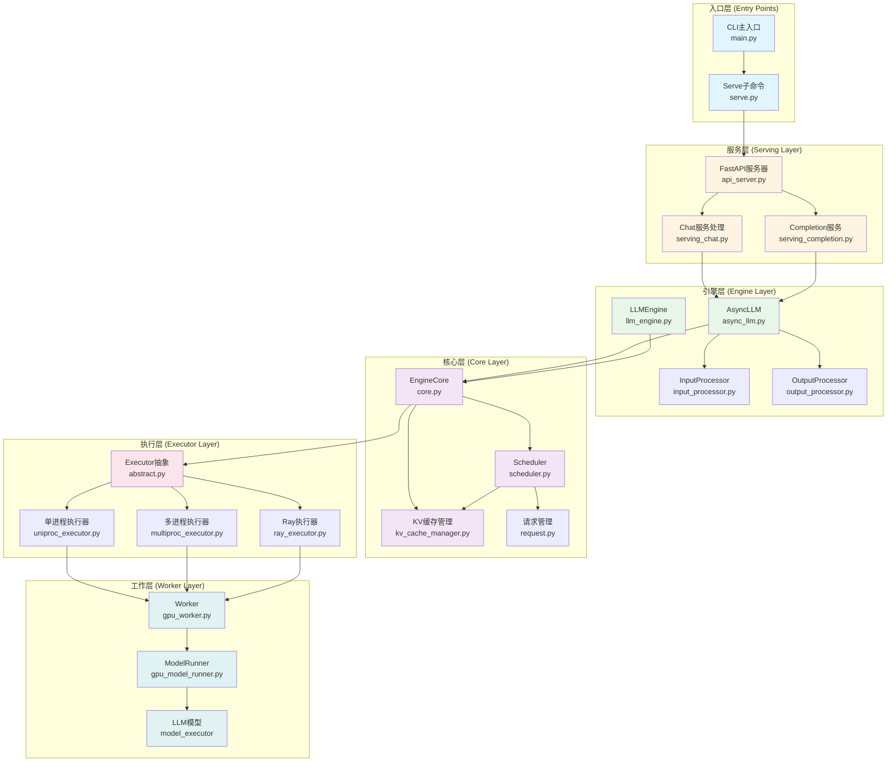
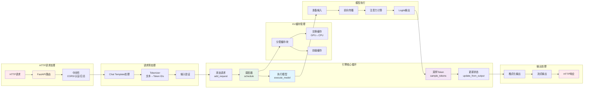
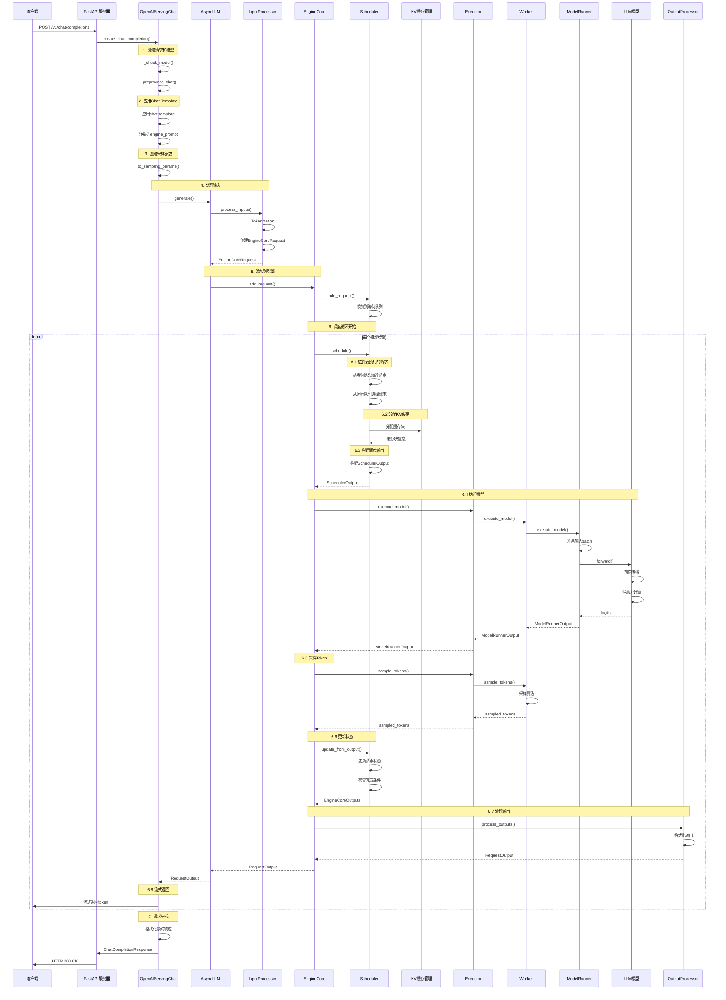
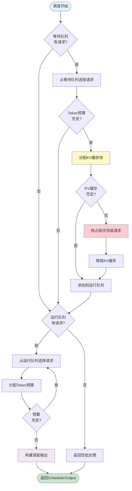
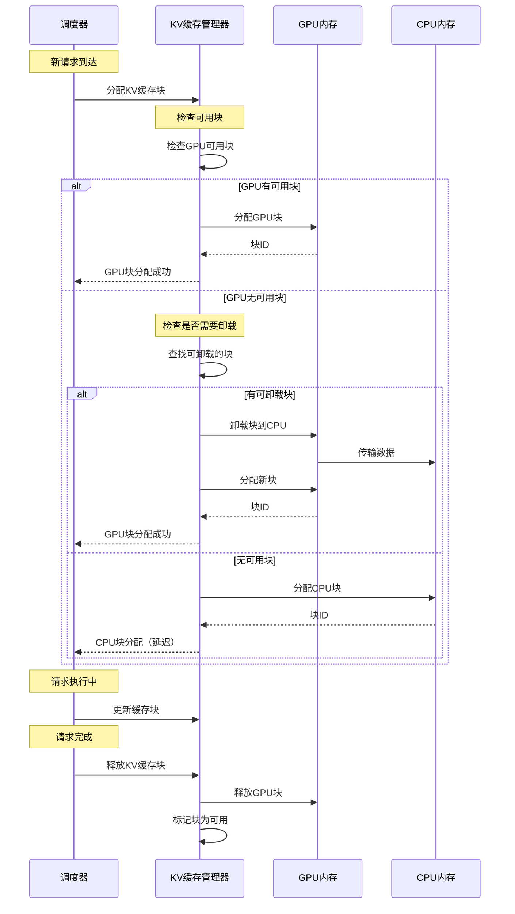
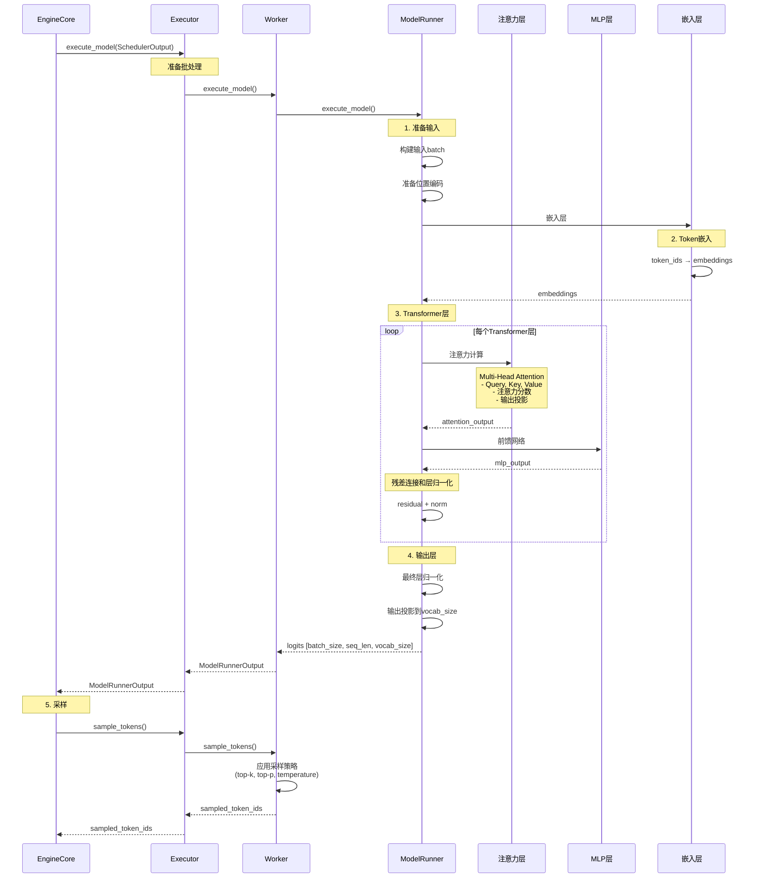
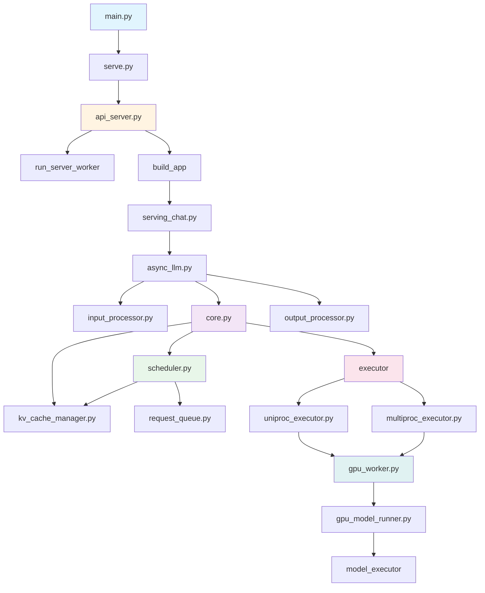

# vLLM 架构图和执行流程图

本文档包含vLLM的整体架构图和详细的执行流程顺序图。

## 1. 整体架构图

下图展示了vLLM的分层架构和主要组件之间的关系：



## 2. 详细组件架构图

下图展示了更详细的组件内部结构和数据流：



## 3. 单请求执行流程顺序图

下图展示了单个Chat Completion请求从接收到响应的完整执行流程：



## 4. 多请求批处理执行流程顺序图

下图展示了多个请求如何被批处理并一起执行的流程：

```mermaid
sequenceDiagram
    participant Req1 as 请求1
    participant Req2 as 请求2
    participant Req3 as 请求3
    participant API as API服务器
    participant EngineCore as EngineCore
    participant Scheduler as Scheduler
    participant Batch as 批处理
    participant Model as 模型
    
    Note over Req1,Req2,Req3: 请求到达
    Req1->>API: HTTP请求1
    Req2->>API: HTTP请求2
    Req3->>API: HTTP请求3
    
    Note over API: 并行处理请求
    par 请求1处理
        API->>EngineCore: add_request(req1)
        EngineCore->>Scheduler: add_request(req1)
        Scheduler->>Scheduler: 添加到等待队列
    and 请求2处理
        API->>EngineCore: add_request(req2)
        EngineCore->>Scheduler: add_request(req2)
        Scheduler->>Scheduler: 添加到等待队列
    and 请求3处理
        API->>EngineCore: add_request(req3)
        EngineCore->>Scheduler: add_request(req3)
        Scheduler->>Scheduler: 添加到等待队列
    end
    
    Note over Scheduler: 调度器批处理
    loop 每个推理步骤
        Scheduler->>Scheduler: schedule()
        
        Note over Scheduler: 选择可执行的请求
        Scheduler->>Scheduler: 检查token预算
        Scheduler->>Scheduler: 选择req1, req2, req3
        
        Note over Scheduler: 构建批处理
        Scheduler->>Batch: 创建批处理
        Note right of Batch: Batch包含:<br/>- req1: 10 tokens<br/>- req2: 5 tokens<br/>- req3: 8 tokens
        
        Scheduler-->>EngineCore: SchedulerOutput
        
        Note over EngineCore,Model: 执行批处理
        EngineCore->>Model: execute_batch()
        Note right of Model: 批处理前向传播:<br/>- 合并输入<br/>- 并行计算<br/>- 输出logits
        Model-->>EngineCore: BatchOutput
        
        Note over EngineCore: 采样和更新
        EngineCore->>EngineCore: sample_tokens()
        EngineCore->>Scheduler: update_from_output()
        
        Note over Scheduler: 更新请求状态
        Scheduler->>Scheduler: req1: 继续生成
        Scheduler->>Scheduler: req2: 完成
        Scheduler->>Scheduler: req3: 继续生成
        
        Note over Scheduler: 移除完成的请求
        Scheduler->>Scheduler: 从运行队列移除req2
        
        Note over EngineCore: 返回输出
        EngineCore-->>API: req1 output
        EngineCore-->>API: req2 output (完成)
        EngineCore-->>API: req3 output
        
        API-->>Req1: 流式token
        API-->>Req2: 最终响应
        API-->>Req3: 流式token
    end
```

## 5. 调度器内部工作流程

下图展示了调度器如何选择和调度请求：



## 6. KV缓存管理流程

下图展示了KV缓存的分配和管理流程：



## 7. 模型执行详细流程

下图展示了模型执行器、Worker和ModelRunner的详细交互：



## 8. 异步处理流程

下图展示了异步请求处理的完整流程：

```mermaid
sequenceDiagram
    participant Client1 as 客户端1
    participant Client2 as 客户端2
    participant API as API服务器
    participant AsyncLLM as AsyncLLM
    participant Queue as 请求队列
    participant EngineCore as EngineCore
    participant Loop as 引擎循环
    
    par 客户端1请求
        Client1->>API: POST /v1/chat/completions
        API->>AsyncLLM: add_request(req1)
        AsyncLLM->>Queue: 添加到队列
        AsyncLLM-->>API: RequestOutputCollector
    and 客户端2请求
        Client2->>API: POST /v1/chat/completions
        API->>AsyncLLM: add_request(req2)
        AsyncLLM->>Queue: 添加到队列
        AsyncLLM-->>API: RequestOutputCollector
    end
    
    Note over Loop: 引擎循环（独立线程/进程）
    loop 引擎循环
        Loop->>EngineCore: step()
        EngineCore->>Queue: 获取待处理请求
        Queue-->>EngineCore: req1, req2
        
        EngineCore->>EngineCore: 调度和执行
        Note over EngineCore: 批处理执行req1和req2
        
        EngineCore->>AsyncLLM: 输出结果
        AsyncLLM->>AsyncLLM: 更新RequestOutputCollector
        
        par 流式返回客户端1
            AsyncLLM-->>Client1: token1
            AsyncLLM-->>Client1: token2
            AsyncLLM-->>Client1: token3
        and 流式返回客户端2
            AsyncLLM-->>Client2: token1
            AsyncLLM-->>Client2: token2
        end
    end
```

## 9. 文件调用关系图

下图展示了主要文件之间的调用关系：



## 10. 总结

以上图表展示了vLLM的完整架构和执行流程：

1. **整体架构图**：展示了6个主要层次和组件关系
2. **详细组件架构图**：展示了数据在各个组件间的流动
3. **单请求执行流程**：展示了从HTTP请求到响应的完整序列
4. **多请求批处理流程**：展示了如何批处理多个并发请求
5. **调度器工作流程**：展示了调度器的决策逻辑
6. **KV缓存管理流程**：展示了KV缓存的分配和管理
7. **模型执行详细流程**：展示了模型前向传播的细节
8. **异步处理流程**：展示了异步请求处理机制
9. **文件调用关系图**：展示了主要文件间的调用关系

这些图表可以帮助理解vLLM的整体架构和请求处理流程。
