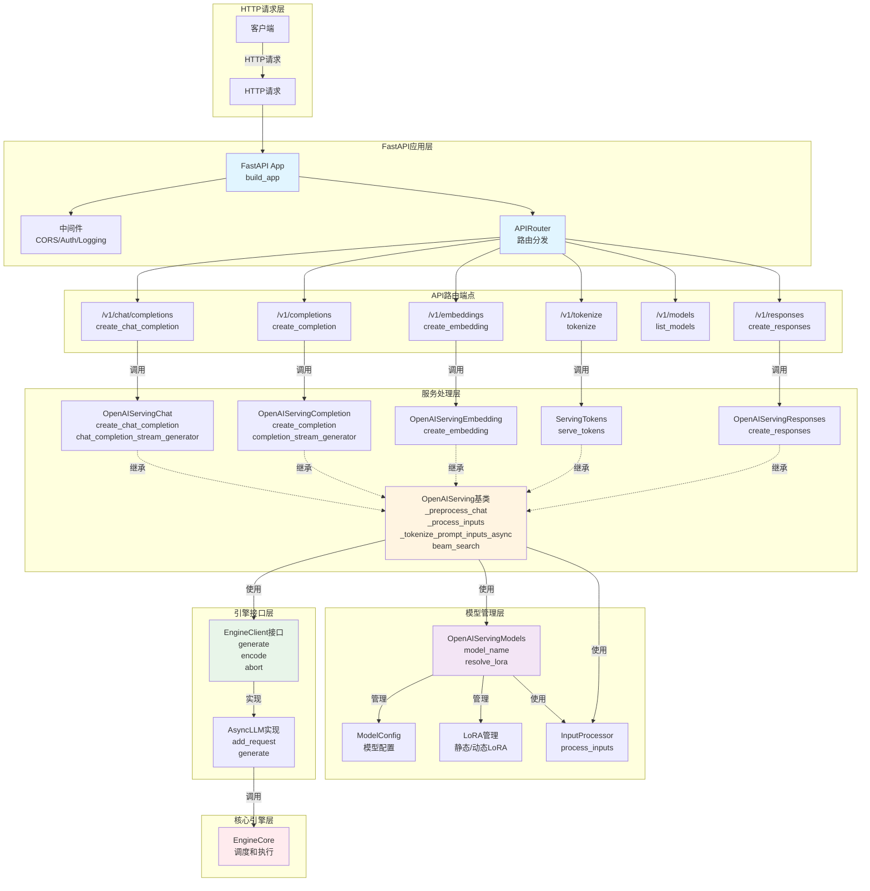

# vLLM 服务层架构设计图

## 服务层整体架构图

```mermaid
graph TB
    subgraph "HTTP请求层"
        Client[客户端]
        HTTP[HTTP请求]
    end
    
    subgraph "FastAPI应用层"
        FastAPI[FastAPI App<br/>build_app]
        Router[APIRouter<br/>路由分发]
        Middleware[中间件<br/>CORS/Auth/Logging]
    end
    
    subgraph "API路由端点"
        ChatRoute["/v1/chat/completions<br/>create_chat_completion"]
        CompletionRoute["/v1/completions<br/>create_completion"]
        EmbedRoute["/v1/embeddings<br/>create_embedding"]
        TokenRoute["/v1/tokenize<br/>tokenize"]
        ModelRoute["/v1/models<br/>list_models"]
        ResponseRoute["/v1/responses<br/>create_responses"]
    end
    
    subgraph "服务处理层"
        ChatServing[OpenAIServingChat<br/>create_chat_completion<br/>chat_completion_stream_generator]
        CompletionServing[OpenAIServingCompletion<br/>create_completion<br/>completion_stream_generator]
        EmbedServing[OpenAIServingEmbedding<br/>create_embedding]
        TokenServing[ServingTokens<br/>serve_tokens]
        ResponseServing[OpenAIServingResponses<br/>create_responses]
        BaseServing[OpenAIServing基类<br/>_preprocess_chat<br/>_process_inputs<br/>_tokenize_prompt_inputs_async<br/>beam_search]
    end
    
    subgraph "引擎接口层"
        EngineClient[EngineClient接口<br/>generate<br/>encode<br/>abort]
        AsyncLLM[AsyncLLM实现<br/>add_request<br/>generate]
    end
    
    subgraph "模型管理层"
        ServingModels[OpenAIServingModels<br/>model_name<br/>resolve_lora]
        ModelConfig[ModelConfig<br/>模型配置]
        InputProcessor[InputProcessor<br/>process_inputs]
        LoRAManager[LoRA管理<br/>静态/动态LoRA]
    end
    
    subgraph "核心引擎层"
        EngineCore[EngineCore<br/>调度和执行]
    end
    
    Client -->|HTTP请求| HTTP
    HTTP --> FastAPI
    FastAPI --> Middleware
    FastAPI --> Router
    
    Router --> ChatRoute
    Router --> CompletionRoute
    Router --> EmbedRoute
    Router --> TokenRoute
    Router --> ModelRoute
    Router --> ResponseRoute
    
    ChatRoute -->|调用| ChatServing
    CompletionRoute -->|调用| CompletionServing
    EmbedRoute -->|调用| EmbedServing
    TokenRoute -->|调用| TokenServing
    ResponseRoute -->|调用| ResponseServing
    
    ChatServing -.->|继承| BaseServing
    CompletionServing -.->|继承| BaseServing
    EmbedServing -.->|继承| BaseServing
    TokenServing -.->|继承| BaseServing
    ResponseServing -.->|继承| BaseServing
    
    BaseServing -->|使用| EngineClient
    BaseServing -->|使用| ServingModels
    BaseServing -->|使用| InputProcessor
    
    EngineClient -->|实现| AsyncLLM
    ServingModels -->|管理| ModelConfig
    ServingModels -->|管理| LoRAManager
    ServingModels -->|使用| InputProcessor
    
    AsyncLLM -->|调用| EngineCore
    
    style FastAPI fill:#e1f5ff
    style Router fill:#e1f5ff
    style BaseServing fill:#fff4e1
    style EngineClient fill:#e8f5e9
    style ServingModels fill:#f3e5f5
    style EngineCore fill:#ffebee
```

